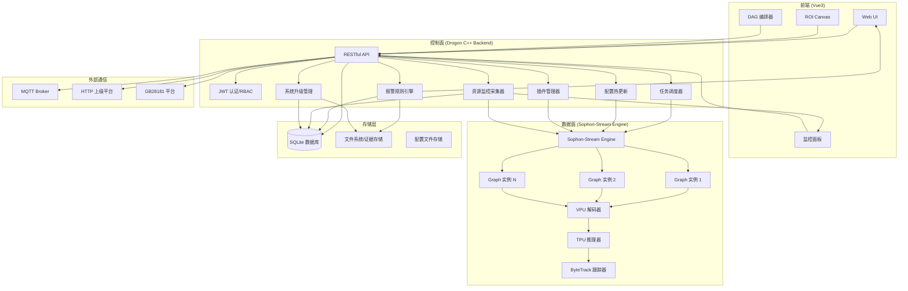
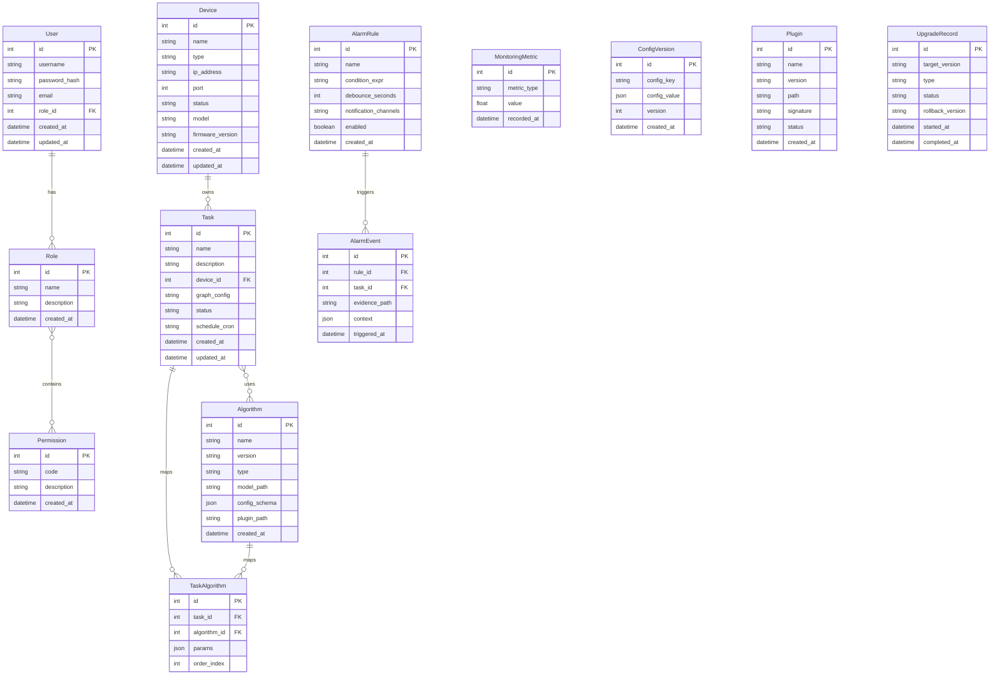

# Sophon-Stream Web 管理系统技术设计

Feature Name: sophon-stream-web-management
Updated: 2026-05-13

## 描述

基于 sophon-stream 流处理框架，构建边缘 AI 视频分析管理平台。系统采用控制面与数据面分离架构，前端 Vue3 + 后端 Drogon C++ Web 框架 + SQLite 数据库，提供设备管理、任务编排、算法插件、资源监控、报警规则等完整功能。

## 架构



## 组件与接口

### 1. 前端组件 (Vue3 + TypeScript)

| 组件 | 职责 | 技术栈 |
|------|------|--------|
| App.vue | 应用入口，路由管理 | Vue Router 4 |
| Layout | 侧边栏布局，头部导航 | Element Plus |
| Login | 用户登录页面 | Element Plus Form |
| Dashboard | 系统仪表盘，资源概览 | ECharts |
| DeviceList | 设备列表，增删改查 | Element Plus Table |
| TaskList | 任务列表，状态管理 | Element Plus Table |
| TaskEditor | 任务编辑，DAG 编排 | Vue Flow |
| AlgorithmList | 算法插件管理 | Element Plus |
| MonitorPanel | 实时监控，WebSocket 推送 | ECharts + WebSocket |
| AlarmList | 报警历史，证据查看 | Element Plus |
| SystemSettings | 系统配置页面 | Element Plus Form |
| ROICanvas | ROI 区域绘制 | HTML Canvas |

### 2. 后端服务 (Drogon C++)

| 模块 | 职责 | 接口 |
|------|------|------|
| HttpController | RESTful API 路由 | /api/v1/* |
| AuthController | 登录/注册/Token 验证 | POST /api/v1/auth/login |
| DeviceController | 设备 CRUD | CRUD /api/v1/devices |
| TaskController | 任务 CRUD + 启停 | CRUD /api/v1/tasks |
| AlgorithmController | 算法插件管理 | CRUD /api/v1/algorithms |
| MonitorController | 资源监控数据 | GET /api/v1/monitoring/* |
| AlarmController | 报警规则 + 历史 | CRUD /api/v1/alarms |
| ConfigController | 配置热更新 | PUT /api/v1/config/* |
| UpgradeController | 系统升级管理 | POST /api/v1/upgrade |
| PluginController | 插件市场管理 | CRUD /api/v1/plugins |
| WebSocketHandler | 实时数据推送 | WS /ws/monitoring |

### 3. 数据面集成 (Sophon-Stream)

| 模块 | 职责 | 集成方式 |
|------|------|----------|
| StreamEngine | Engine 生命周期管理 | C++ API 直接调用 |
| GraphManager | Graph 实例创建/销毁 | Graph::createGraph() |
| ElementRegistry | Element 注册与配置 | JSON 配置加载 |
| ResultCollector | 处理结果收集 | 回调函数机制 |
| ConfigHotUpdater | 配置热更新 | Engine::updateConfig() |

### 4. 基础设施

| 模块 | 职责 | 实现 |
|------|------|------|
| DatabaseManager | SQLite ORM 封装 | sqlite_orm 库 |
| JWTManager | JWT 签发/验证 | jwt-cpp 库 |
| RBACManager | 角色权限管理 | 数据库 + 内存缓存 |
| LogManager | 日志系统 | spdlog 库 |
| ResourceCollector | 系统资源采集 | /proc + BM 接口 |
| AlarmRuleEngine | 报警规则评估 | 规则引擎 + 防抖动 |
| TaskScheduler | 定时任务调度 | cron-cpp 库 |
| PluginLoader | 动态库加载 | dlopen/dlsym |
| UpgradeManager | 差分升级管理 | xdelta3 + 回滚 |
| CommManager | 外部通信协议 | MQTT/HTTP/GB28181 |

## 数据模型

### 核心实体



### 数据库 Schema (SQLite)

```sql
-- 用户表
CREATE TABLE users (
    id INTEGER PRIMARY KEY AUTOINCREMENT,
    username VARCHAR(50) UNIQUE NOT NULL,
    password_hash VARCHAR(255) NOT NULL,
    email VARCHAR(100),
    role_id INTEGER REFERENCES roles(id),
    created_at DATETIME DEFAULT CURRENT_TIMESTAMP,
    updated_at DATETIME DEFAULT CURRENT_TIMESTAMP
);

-- 角色表
CREATE TABLE roles (
    id INTEGER PRIMARY KEY AUTOINCREMENT,
    name VARCHAR(50) UNIQUE NOT NULL,
    description TEXT,
    created_at DATETIME DEFAULT CURRENT_TIMESTAMP
);

-- 权限表
CREATE TABLE permissions (
    id INTEGER PRIMARY KEY AUTOINCREMENT,
    code VARCHAR(100) UNIQUE NOT NULL,
    description TEXT,
    created_at DATETIME DEFAULT CURRENT_TIMESTAMP
);

-- 角色权限关联表
CREATE TABLE role_permissions (
    role_id INTEGER REFERENCES roles(id),
    permission_id INTEGER REFERENCES permissions(id),
    PRIMARY KEY (role_id, permission_id)
);

-- 设备表
CREATE TABLE devices (
    id INTEGER PRIMARY KEY AUTOINCREMENT,
    name VARCHAR(100) NOT NULL,
    type VARCHAR(50) NOT NULL,
    ip_address VARCHAR(45) NOT NULL,
    port INTEGER DEFAULT 8080,
    status VARCHAR(20) DEFAULT 'offline',
    model VARCHAR(50),
    firmware_version VARCHAR(20),
    created_at DATETIME DEFAULT CURRENT_TIMESTAMP,
    updated_at DATETIME DEFAULT CURRENT_TIMESTAMP
);

-- 任务表
CREATE TABLE tasks (
    id INTEGER PRIMARY KEY AUTOINCREMENT,
    name VARCHAR(100) NOT NULL,
    description TEXT,
    device_id INTEGER REFERENCES devices(id),
    graph_config TEXT,
    status VARCHAR(20) DEFAULT 'stopped',
    schedule_cron VARCHAR(50),
    created_at DATETIME DEFAULT CURRENT_TIMESTAMP,
    updated_at DATETIME DEFAULT CURRENT_TIMESTAMP
);

-- 算法表
CREATE TABLE algorithms (
    id INTEGER PRIMARY KEY AUTOINCREMENT,
    name VARCHAR(100) NOT NULL,
    version VARCHAR(20) NOT NULL,
    type VARCHAR(50) NOT NULL,
    model_path VARCHAR(255),
    config_schema TEXT,
    plugin_path VARCHAR(255),
    created_at DATETIME DEFAULT CURRENT_TIMESTAMP
);

-- 任务算法关联表
CREATE TABLE task_algorithms (
    id INTEGER PRIMARY KEY AUTOINCREMENT,
    task_id INTEGER REFERENCES tasks(id),
    algorithm_id INTEGER REFERENCES algorithms(id),
    params TEXT,
    order_index INTEGER NOT NULL
);

-- 报警规则表
CREATE TABLE alarm_rules (
    id INTEGER PRIMARY KEY AUTOINCREMENT,
    name VARCHAR(100) NOT NULL,
    condition_expr TEXT NOT NULL,
    debounce_seconds INTEGER DEFAULT 0,
    notification_channels TEXT,
    enabled BOOLEAN DEFAULT 1,
    created_at DATETIME DEFAULT CURRENT_TIMESTAMP
);

-- 报警事件表
CREATE TABLE alarm_events (
    id INTEGER PRIMARY KEY AUTOINCREMENT,
    rule_id INTEGER REFERENCES alarm_rules(id),
    task_id INTEGER REFERENCES tasks(id),
    evidence_path VARCHAR(255),
    context TEXT,
    triggered_at DATETIME DEFAULT CURRENT_TIMESTAMP
);

-- 监控指标表
CREATE TABLE monitoring_metrics (
    id INTEGER PRIMARY KEY AUTOINCREMENT,
    metric_type VARCHAR(50) NOT NULL,
    value REAL NOT NULL,
    recorded_at DATETIME DEFAULT CURRENT_TIMESTAMP
);

-- 配置版本表
CREATE TABLE config_versions (
    id INTEGER PRIMARY KEY AUTOINCREMENT,
    config_key VARCHAR(100) NOT NULL,
    config_value TEXT NOT NULL,
    version INTEGER NOT NULL,
    created_at DATETIME DEFAULT CURRENT_TIMESTAMP
);

-- 插件表
CREATE TABLE plugins (
    id INTEGER PRIMARY KEY AUTOINCREMENT,
    name VARCHAR(100) NOT NULL,
    version VARCHAR(20) NOT NULL,
    path VARCHAR(255) NOT NULL,
    signature VARCHAR(255),
    status VARCHAR(20) DEFAULT 'inactive',
    created_at DATETIME DEFAULT CURRENT_TIMESTAMP
);

-- 升级记录表
CREATE TABLE upgrade_records (
    id INTEGER PRIMARY KEY AUTOINCREMENT,
    target_version VARCHAR(20) NOT NULL,
    type VARCHAR(20) NOT NULL,
    status VARCHAR(20) DEFAULT 'pending',
    rollback_version VARCHAR(20),
    started_at DATETIME DEFAULT CURRENT_TIMESTAMP,
    completed_at DATETIME
);
```

## 正确性属性

### 不变量

1. DAG 图结构必须是有向无环图，保存时验证无环
2. JWT Token 有效期不超过 24 小时
3. 同一时刻同一设备只能被一个活跃任务独占使用
4. 配置版本号严格递增，回滚时创建新版本而非修改历史
5. 报警防抖动窗口内相同规则不触发新事件
6. 插件签名验证失败时不加载该插件
7. 升级包签名验证失败时不执行升级
8. 数据库事务保证设备/任务/配置的原子性操作

### 约束

1. TPU 使用率不超过 95%，超过时触发降级
2. 内存占用不超过 512MB（空闲状态）
3. 磁盘占用不超过 2GB，超过时清理过期日志和监控数据
4. 单个任务最多关联 4 路视频流
5. ROI 坐标必须在视频画面边界内
6. JWT 密钥长度至少 256 位
7. 密码必须经过 bcrypt 哈希存储

## 错误处理

### 错误场景与策略

| 场景 | 处理方式 | 恢复策略 |
|------|----------|----------|
| 数据库连接失败 | 返回 500，记录错误日志 | 5 秒后自动重连 |
| sophon-stream Engine 启动失败 | 记录错误日志，标记任务失败 | 检查配置文件，手动重试 |
| Graph 运行时异常 | 停止 Graph，记录错误日志 | 发送告警，等待管理员处理 |
| JWT Token 无效 | 返回 401 | 用户重新登录 |
| 权限不足 | 返回 403 | 联系管理员授权 |
| 热更新配置失败 | 返回错误，回滚配置 | 使用上一版本配置 |
| 插件加载失败 | 记录日志，跳过插件 | 检查插件兼容性 |
| 升级中断 | 标记升级失败 | 回滚至上一版本 |
| MQTT 连接断开 | 记录日志，缓存消息 | 自动重连并重发消息 |
| WebSocket 断连 | 前端自动重连 | 3 秒后重试，最多 5 次 |
| 视频流断流 | 记录日志，标记任务异常 | 30 秒后自动重连 |
| TPU 过热 | 降级处理路数 | 降低至安全温度后恢复 |

### 错误码定义

```cpp
enum ErrorCode {
    SUCCESS = 0,
    ERR_INVALID_REQUEST = 400,
    ERR_UNAUTHORIZED = 401,
    ERR_FORBIDDEN = 403,
    ERR_NOT_FOUND = 404,
    ERR_CONFLICT = 409,
    ERR_INTERNAL_ERROR = 500,
    ERR_SERVICE_UNAVAILABLE = 503,
    
    // 业务错误码 1000+
    ERR_DEVICE_OFFLINE = 1001,
    ERR_TASK_ALREADY_RUNNING = 1002,
    ERR_GRAPH_CREATE_FAILED = 1003,
    ERR_CONFIG_UPDATE_FAILED = 1004,
    ERR_PLUGIN_LOAD_FAILED = 1005,
    ERR_UPGRADE_FAILED = 1006,
    ERR_ROI_OUT_OF_BOUNDS = 1007,
    ERR_DAG_HAS_CYCLE = 1008,
    ERR_MODEL_NOT_FOUND = 1009,
    ERR_SIGNATURE_VERIFY_FAILED = 1010,
};
```

## 测试策略

### 单元测试

| 模块 | 测试框架 | 覆盖率目标 |
|------|----------|------------|
| 认证授权 | Google Test | 90% |
| 数据库 ORM | Google Test | 90% |
| 配置热更新 | Google Test | 85% |
| 报警规则引擎 | Google Test | 90% |
| 插件加载器 | Google Test | 85% |
| 资源监控采集 | Google Test | 80% |

### 集成测试

| 场景 | 测试方法 |
|------|----------|
| API 端到端 | curl/Postman 脚本 |
| sophon-stream 集成 | 模拟视频流输入 |
| WebSocket 推送 | WebSocket 客户端测试 |
| MQTT 通信 | Mosquitto 测试 Broker |
| 升级回滚 | 模拟升级包安装 |

### 前端测试

| 类型 | 工具 | 内容 |
|------|------|------|
| 组件测试 | Vitest + Vue Test Utils | 各 UI 组件渲染和交互 |
| E2E 测试 | Playwright | 完整用户流程 |
| 性能测试 | Lighthouse | 页面加载性能 |

### 性能测试

| 指标 | 目标 | 测试方法 |
|------|------|----------|
| API 响应时间 | < 200ms | wrk/ab 压测 |
| 并发连接数 | > 100 | 并发客户端测试 |
| 视频流处理路数 | 4-8 路 1080P | 实际视频流压测 |
| TPU 利用率 | < 80% (4 路) | 硬件监控 |
| 内存占用 | < 512MB | valgrind/htop |

## 项目结构

```
sophon-stream-web/
├── frontend/                    # Vue3 前端项目
│   ├── src/
│   │   ├── api/                 # API 请求封装
│   │   ├── assets/              # 静态资源
│   │   ├── components/          # 公共组件
│   │   ├── composables/         # 组合式函数
│   │   ├── layouts/             # 布局组件
│   │   ├── router/              # 路由配置
│   │   ├── stores/              # Pinia 状态管理
│   │   ├── views/               # 页面组件
│   │   │   ├── Login.vue
│   │   │   ├── Dashboard.vue
│   │   │   ├── devices/
│   │   │   ├── tasks/
│   │   │   ├── algorithms/
│   │   │   ├── monitoring/
│   │   │   ├── alarms/
│   │   │   └── settings/
│   │   ├── App.vue
│   │   └── main.ts
│   ├── public/
│   ├── package.json
│   ├── vite.config.ts
│   └── tsconfig.json
│
├── backend/                     # Drogon C++ 后端项目
│   ├── src/
│   │   ├── controllers/         # HTTP 控制器
│   │   ├── models/              # 数据模型
│   │   ├── services/            # 业务逻辑
│   │   │   ├── AuthService.cpp/.h
│   │   │   ├── DeviceService.cpp/.h
│   │   │   ├── TaskService.cpp/.h
│   │   │   ├── AlgorithmService.cpp/.h
│   │   │   ├── MonitorService.cpp/.h
│   │   │   ├── AlarmService.cpp/.h
│   │   │   ├── ConfigService.cpp/.h
│   │   │   ├── UpgradeService.cpp/.h
│   │   │   ├── PluginService.cpp/.h
│   │   │   └── StreamEngineService.cpp/.h
│   │   ├── middleware/          # 中间件
│   │   │   ├── AuthMiddleware.cpp/.h
│   │   │   └── RBACMiddleware.cpp/.h
│   │   ├── websocket/           # WebSocket 处理
│   │   │   └── MonitorWebSocket.cpp/.h
│   │   ├── db/                  # 数据库
│   │   │   ├── DatabaseManager.cpp/.h
│   │   │   └── migrations/      # 数据库迁移
│   │   ├── config/              # 配置管理
│   │   │   └── ConfigManager.cpp/.h
│   │   └── main.cpp             # 入口
│   ├── include/                 # 公共头文件
│   ├── tests/                   # 单元测试
│   ├── CMakeLists.txt
│   └── config.json              # Drogon 配置
│
├── engine/                      # sophon-stream 集成层
│   ├── src/
│   │   ├── StreamEngine.cpp/.h
│   │   ├── GraphManager.cpp/.h
│   │   ├── ElementRegistry.cpp/.h
│   │   ├── ResultCollector.cpp/.h
│   │   └── ConfigHotUpdater.cpp/.h
│   ├── CMakeLists.txt
│   └── configs/                 # 默认配置文件
│
├── plugins/                     # 插件系统
│   ├── src/
│   │   ├── PluginLoader.cpp/.h
│   │   ├── PluginRegistry.cpp/.h
│   │   └── PluginValidator.cpp/.h
│   └── samples/                 # 示例插件
│
├── scripts/                     # 构建和部署脚本
│   ├── build.sh
│   ├── deploy.sh
│   ├── upgrade.sh
│   └── rollback.sh
│
├── docs/                        # 文档
│   ├── ARCHITECTURE.md
│   ├── API.md
│   └── DEPLOYMENT.md
│
├── .monkeycode/                 # 项目规范和文档
│   ├── specs/
│   └── MEMORY.md
│
├── CMakeLists.txt               # 根 CMake 配置
├── Makefile                     # 便捷命令
├── .gitignore
└── README.md
```

## 构建与部署

### 构建命令

```bash
# 构建前端
cd frontend && npm install && npm run build

# 构建后端
mkdir -p build && cd build
cmake .. -DCMAKE_BUILD_TYPE=Release
make -j$(nproc)

# 构建引擎集成层
cd engine && mkdir -p build && cd build
cmake .. -DCMAKE_BUILD_TYPE=Release
make -j$(nproc)
```

### 部署流程

1. 编译前端并生成静态文件
2. 编译后端二进制和引擎库
3. 将静态文件拷贝至后端 www 目录
4. 配置 Drogon 服务静态文件
5. 启动后端服务
6. Drogon 同时提供前端 SPA 和 API

### 依赖清单

| 依赖 | 用途 | 版本 |
|------|------|------|
| Drogon | Web 框架 | >= 1.9.0 |
| sqlite_orm | SQLite ORM | >= 1.8.0 |
| jwt-cpp | JWT 处理 | >= 0.7.0 |
| spdlog | 日志库 | >= 1.12.0 |
| nlohmann/json | JSON 解析 | >= 3.11.0 |
| Vue3 | 前端框架 | >= 3.4.0 |
| Element Plus | UI 组件库 | >= 2.7.0 |
| ECharts | 图表库 | >= 5.5.0 |
| Vue Flow | DAG 编排 | >= 1.30.0 |
| Pinia | 状态管理 | >= 2.1.0 |
| Vite | 构建工具 | >= 5.0.0 |
| sophon-stream | 流处理框架 | 最新主干 |
| OpenSSL | TLS/加密 | >= 3.0.0 |

## 安全设计

1. **认证**：JWT Bearer Token，有效期 2 小时，支持刷新
2. **授权**：RBAC 模型，角色-权限-资源三级控制
3. **传输**：HTTPS (TLS 1.2+)，可选启用
4. **存储**：密码 bcrypt 哈希，敏感数据加密
5. **插件**：数字签名验证，不加载未签名插件
6. **升级**：升级包签名验证，升级失败自动回滚
7. **API**：速率限制，防暴力破解
8. **日志**：操作审计日志，不可篡改

## 参考

[^1]: (GitHub) - [sophon-stream 官方仓库](https://github.com/sophgo/sophon-stream)
[^2]: (GitHub) - [Drogon Web 框架](https://github.com/drogonframework/drogon)
[^3]: (GitHub) - [sqlite_orm](https://github.com/fnc12/sqlite_orm)
[^4]: (GitHub) - [jwt-cpp](https://github.com/Thalhammer/jwt-cpp)
[^5]: (GitHub) - [spdlog](https://github.com/gabime/spdlog)
[^6]: (GitHub) - [Element Plus](https://github.com/element-plus/element-plus)
[^7]: (GitHub) - [Vue Flow](https://github.com/bcakmakoglu/vue-flow)
